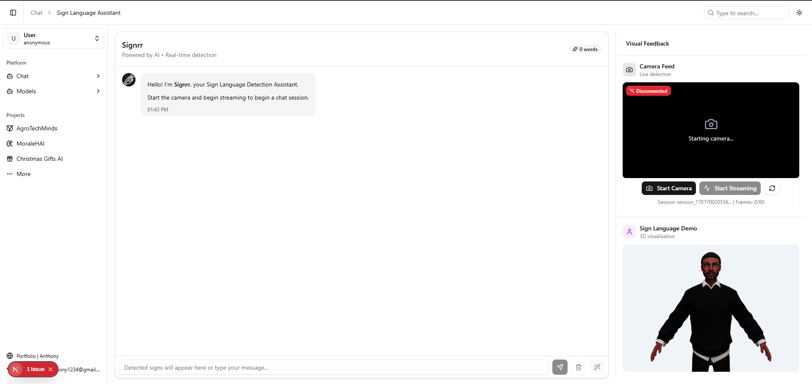

# Sign Language Detector — Frontend

<!--  -->



This repository contains the frontend for a real-time Sign Language Detector application built with Next.js, React, and React Three Fiber. The app provides:

- **Chatbot-style UI**: Interactive chat interface with AI-powered responses and markdown formatting support
- **Real-time Sign Detection**: WebSocket connection to FastAPI backend for live sign language detection
- **Automatic Gloss Interpretation**: AI converts detected glosses to natural language when streaming stops
- **AI Chat Integration**: Send interpreted sentences to `/chat` endpoint for contextual AI responses
- **Visual Feedback Panel**: Live camera feed and 3D model viewer (React Three Fiber) for sign visualization
- **Frame Buffering**: Intelligent 60-frame buffering at 30fps for optimal detection accuracy

This README explains how to run the project locally, what is implemented, and the architecture of the real-time detection system.

## Quick Start (Development)

This project uses **pnpm** as the primary package manager.

### Prerequisites

- Node.js 18+ installed
- Running FastAPI backend at `http://localhost:8000` with:
  - WebSocket endpoint: `ws://localhost:8000/ws/stream/{session_id}`
  - REST endpoint: `POST /interpret-glosses` for gloss interpretation
  - REST endpoint: `POST /chat` for AI conversational responses
- Camera/webcam access

### Installation & Running

```bash
# Install dependencies
pnpm install

# Start development server
pnpm dev
```

Visit `http://localhost:3000` to view the application.

## Architecture

### Core Components

- **`app/src/root-enhanced.tsx`** — Main application orchestrator managing state and component coordination
- **`components/layout/chat/chat-interface-enhanced.tsx`** — Chat UI with real-time detection, AI responses, and markdown rendering
- **`components/layout/video/camera-stream-enhanced.tsx`** — Camera capture with frame buffering and WebSocket streaming
- **`components/layout/right-panel/right-panel-enhanced.tsx`** — Visual panel with camera feed and 3D viewer
- **`components/layout/3d/model-viewer.tsx`** — React Three Fiber canvas with GLB/GLTF support

### Custom Hooks

- **`use-webcam.ts`** — Camera access and frame capture management
- **`use-frame-buffer.ts`** — 60-frame buffering at 30fps
- **`use-sign-language-stream.ts`** — WebSocket connection and prediction handling

### Type Definitions

- **`types/sign-language.ts`** — TypeScript interfaces for predictions, messages, and WebSocket communication

### Real-time Detection Flow

1. **Camera Capture** (30 fps) — Captures frames from webcam
2. **Frame Buffering** — Collects 60 frames (2 seconds of video)
3. **WebSocket Streaming** — Sends buffered frames to backend every 2 seconds
4. **Backend Processing** — VideoMAE model processes frames and returns predictions
5. **Gloss Display** — Top prediction and alternatives shown in real-time
6. **Auto-interpretation** — When streaming stops, glosses sent to `/interpret-glosses` endpoint
7. **Natural Language** — Interpreted sentence displayed in input field
8. **AI Chat** — User sends message to `/chat` endpoint for conversational response
9. **Markdown Response** — AI response rendered with formatting (code, lists, etc.)

### Expected API Responses

**Gloss Prediction** (WebSocket):

```json
{
  "type": "prediction",
  "data": {
    "gloss": "WATER",
    "confidence": 0.87,
    "top5": [
      ["WATER", 0.87],
      ["DRINK", 0.05],
      ["MILK", 0.03]
    ],
    "timestamp": 1704713024123,
    "latency_ms": 45.2
  }
}
```

**Gloss Interpretation** (`POST /interpret-glosses`):

```json
{
  "sentence": "I need water to drink"
}
```

**AI Chat Response** (`POST /chat`):

````json
{
  "response": "Sure! **Water** is essential for hydration. Here are some tips:\n\n- Drink 8 glasses daily\n- Stay hydrated during exercise\n\n```python\nwater_intake = 8  # glasses per day\n```",
  "timestamp": 1704713124456
}
````

## Features

### ✅ Implemented

- **Real-time Sign Detection**: WebSocket-based streaming to FastAPI backend with VideoMAE model
- **Frame Buffering**: Intelligent 60-frame buffering system (30fps) for optimal detection accuracy
- **Automatic Gloss Interpretation**: AI-powered gloss-to-sentence conversion via `/interpret-glosses` endpoint
- **AI Chat Integration**: Conversational AI responses via `/chat` endpoint with interpreted sentences
- **Markdown Rendering**: Rich text formatting for AI responses (code blocks, lists, bold, italic)
- **Editable Input**: Type or edit detected signs before sending to chat
- **Word Choices System**: Tracks top-5 predictions for each detected sign
- **Chat Interface**: Scrollable message history with user and AI messages
- **Camera Controls**: Start/stop camera and streaming with real-time status indicators
- **3D Model Viewer**: React Three Fiber-based visualization with GLB/GLTF support
- **Session Management**: Unique session IDs for each detection session
- **Error Handling**: Comprehensive error handling and connection recovery
- **Loading States**: Visual feedback during interpretation and AI response generation

### 🚧 In Progress

- Animation mapping: Connecting detected signs to 3D character animations
- Performance optimization: Reducing frame processing overhead
- UI polish: Enhanced visual feedback and status indicators

### 📋 Planned Features

- **Animation Sync**: Map detected signs to 3D character animations in real-time
- **Multi-model Support**: Switch between different detection models
- **Performance Dashboard**: Real-time metrics for FPS, latency, and accuracy
- **Offline Mode**: Local model inference using TensorFlow.js or ONNX Runtime
- **Mobile Support**: Responsive design and touch controls
- **Recording**: Save and replay detection sessions
- **Custom Vocabulary**: Train custom sign mappings
- **Multi-language**: Support for different sign languages (ASL, BSL, etc.)

## Usage

1. **Start the camera**: Click "Start Camera" button in the right panel
2. **Connect WebSocket**: Click "Start Streaming" to begin detection
3. **Perform signs**: System captures 60 frames every 2 seconds
4. **View predictions**: Detected glosses appear in real-time in the input field
5. **Auto-interpretation**: System automatically interprets glosses into natural language
6. **Edit if needed**: Manually edit the interpreted text before sending
7. **Send to chat**: Click send icon to get AI response
8. **View response**: AI response appears with markdown formatting
9. **Clear**: Click trash icon to clear current glosses and start over

### Controls

- 🎥 **Camera**: Start/Stop webcam access
- 📡 **Streaming**: Start/Stop detection and frame transmission
- ✏️ **Input Field**: Edit detected signs or type manually
- 📤 **Send**: Send message to AI chat endpoint
- 🗑️ **Clear**: Clear current glosses/text
- 🪄 **Re-interpret**: Manually trigger gloss interpretation

## 3D Model Integration

### Using Custom Models

1. Place your GLB/GLTF file in `public/models/`, e.g., `public/models/human.glb`
2. Open `components/layout/3d/model-viewer.tsx`
3. Set `customModelPath` to `"/models/human.glb"`
4. Restart the dev server

### Model Recommendations

- **Rigged characters** with animation clips (Mixamo exports work well)
- **Optimized file size** for better performance
- **Proper scaling** — adjust `scale` and `position` props if needed

### Lighting & Visuals

The 3D scene includes:

- Multiple lighting presets
- Soft ground shadows (AccumulativeShadows + ContactShadows)
- Adjustable for lower-end devices by reducing `frames` or disabling shadows

## Tech Stack

- **Framework**: Next.js 15 with App Router
- **Language**: TypeScript
- **Styling**: TailwindCSS + Shadcn/ui
- **3D Rendering**: React Three Fiber + Three.js + Drei
- **Markdown**: react-markdown + remark-gfm
- **State Management**: React hooks and callbacks
- **WebSocket**: Native WebSocket API
- **Package Manager**: pnpm

## Contributing

Open a PR or create issues for feature requests. For major changes (model pipelines, ML integration), please discuss the API contract first.

## License

NOT AVAILABLE FOR COMMERCIAL USE

---

**Backend Integration Note**: This frontend requires a FastAPI backend with VideoMAE model for sign language detection. See the backend repository for setup instructions.

### State Management

The app uses React state and callbacks to manage:

- **Prediction Flow**: Camera → WebSocket → Chat interface
- **Streaming State**: Synchronized across all components
- **Word Choices Array**: Built during streaming from top-5 predictions
- **Auto-interpretation**: Triggered automatically when streaming stops
- **Chat Messages**: User messages and AI responses with markdown support
- **Loading States**: Visual feedback during API calls

## Debugging & Development

Start the dev server with:

```bash
pnpm dev
```

Open DevTools (F12) to view detailed console logs:

- `✅ WebSocket OPENED` — Connection established
- `🔔 ONMESSAGE FIRED` — Prediction received
- `🎯 Prediction extracted` — Gloss parsed
- `📥 [CHAT] Received predictions` — Chat received update
- `⏹️ Streaming stopped` — Auto-interpretation triggered
- `📨 Sent to chat` — Message sent to AI
- `🤖 AI Response` — AI response received

### Common Issues

- **Camera permission denied**: Allow camera access and run on `localhost` or HTTPS
- **WebSocket connection failed**: Verify backend is running at `ws://localhost:8000`
- **No predictions received**: Check backend logs to confirm WebSocket messages
- **AI chat fails**: Ensure `/chat` endpoint is implemented on backend
- **Performance issues**: Reduce frame rate or disable AccumulativeShadows in 3D viewer
- **Markdown not rendering**: Verify `react-markdown` and `remark-gfm` are installed
